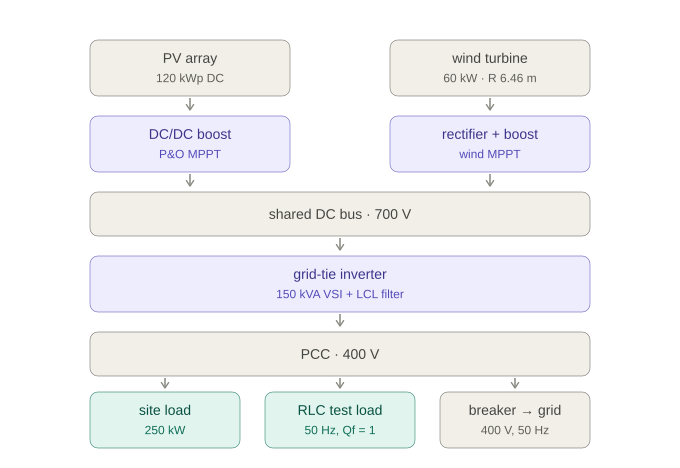

# Hybrid PV–Wind System with Grid Synchronization

Grid-connected hybrid PV and wind system, delivered entirely in simulation.
**SEDE Studios, Spring 2026 — Team 1, Smart Grid Technologies.**

Product Owner: Mohammad Abuhilaleh · Coordinators: Valerie Gay, Dayna Sais, Can Ding

## What it is

DC-coupled design, sized for a **light-industrial site behind the meter**: a factory
with ~250 kW peak demand on a 400 V connection. A 120 kWp PV array feeds a boost
converter under Perturb & Observe MPPT; a 60 kW PMSG wind subsystem feeds the same bus
through a rectifier and its own boost. The shared DC link exports through **one**
three-phase SVPWM inverter using dq-frame PI current control and an SRF-PLL.
Anti-islanding uses Sandia Frequency Shift, assessed by non-detection zone analysis
against AS/NZS 4777.2:2020.

Ratings: 120 kWp PV + 60 kW wind → 700 V DC link → 150 kVA inverter → 400 V, 50 Hz
grid, with a 250 kW site load and an RLC test load at the PCC.



The 150 kVA rating is deliberate: it sits under the 200 kVA ceiling of
AS/NZS 4777.2, so that standard — and every success criterion below — still applies.
See [docs/decisions.md](docs/decisions.md) for why this scale, why one inverter, and
what was deliberately left out.

## Success criteria

| Metric | Target |
|---|---|
| Current THD at rated output | < 5% |
| DC-link voltage deviation | < 5%, recover within 200 ms |
| Inner current loop settling | < 2 ms, overshoot < 10% |
| PLL re-lock after 30° phase jump | < 100 ms |
| Islanding detect + disconnect | < 2 s |
| Stable operation | down to SCR = 3 |

## Layout

```
docs/         proposal, subsystem specs
params/       shared parameter files — single source of truth
models/
  wind/       turbine, PMSG, rectifier, boost      Huy
  pv/         PV array, boost, MPPT                Belal
  control/    SRF-PLL, dq current loop, DC-link    Aqib, Duc
  protection/ SFS anti-islanding, NDZ analysis     Redhwan
  integration/ top-level model, DC link, harness   Hoang
scripts/      analysis + verification scripts
tests/scenarios/  test cases and expected results
```

## Team

| Name | Area | Studio |
|---|---|---|
| Hoang Gia Khiem Khuc | Integration, test harness | Application Studio B |
| Ba Huy Ta | Wind plant, validation | Professional Studio B |
| Duc Pham | Control design | Professional Studio B |
| Belal Abu-issa | PV plant | Professional Studio B |
| S M Redhwan Ahmed | Protection, anti-islanding | Professional Studio A |
| Aqib Mohamed Ameer | Control design | Professional Studio B |

## Getting started

Requires MATLAB R2026a with Simulink, Simscape, and **Simscape Electrical
(Specialized Power Systems)**. Control System Toolbox and Simulink Control Design
are used for loop tuning.

> **Check before you build on Specialized Power Systems:** `powerlib` is not on the
> lab image. The wind models need only foundation Simscape Electrical (`ee_lib`),
> which is present.

```matlab
addpath(genpath('params'), genpath('scripts'), genpath('models'));
wp = windParams();      % load wind subsystem parameters
wind_model_check        % sizing arithmetic only - no Simulink needed
wind_model_lint         % library links resolved, no literal design parameters
wind_scenarios          % 6 scenarios, 10 checks, both MPPT modes
wind_fidelity_check     % averaged vs switched cross-validation
wind_thd_check          % FFT / THD of the switched model (stator, DC bus, inductor)
```

The wind branch is built and tested standalone at 60 kW: two fidelities, cross-validated
to under 1%, with a 6-scenario / 10-check harness. See
[docs/wind-model-spec.md](docs/wind-model-spec.md) §6a and
[docs/traceability.md](docs/traceability.md).

## Working on models

**Simulink `.slx` files are binary. Git cannot merge them.** If two people edit the
same model on different branches, resolving the conflict means one side's work is
lost. `.gitattributes` marks them binary so git fails loudly instead of corrupting
a model with a bogus text merge.

To stay out of trouble:

- **Own your file.** Work only inside your own `models/<area>/` directory. If you
  need a change in someone else's model, ask them — don't edit it.
- **Say so before editing a shared model.** `models/integration/` is Hoang's. Post
  in the chat before touching it, and push as soon as you're done.
- **Never put a constant in a block mask.** Put it in `params/` and reference it.
  Parameter files are plain `.m`, so they diff and merge normally — this is how we
  avoid most model conflicts in the first place.
- **Small, frequent commits.** A day of unpushed model work is a day at risk.

## Conventions

- Every subsystem exposes its parameters through one file in `params/`.
- Two fidelities per plant: **averaged** for controller tuning and parameter sweeps,
  **switched** for THD and final validation. Both read the same parameter file so
  they cannot drift.
- Simulation outputs (`.mat`, `.csv`, figures) are gitignored — commit the script
  that regenerates them, not the result.

## Bandwidth separation

Loops are tuned inside-out. The separation is what makes that valid:

| Loop | Owner | Speed |
|---|---|---|
| Grid-side inner current loop | Aqib, Duc | 2 ms settling |
| DC-link voltage loop | Aqib, Duc | ~200 ms recovery |
| Source-side boost + MPPT | Huy, Belal | ~1 s |
| Wind rotor (mechanical) | Huy | ~4.8 s measured |

The rotor is ~24× slower than the DC-link loop, so the control pair can tune the
cascade without modelling wind dynamics. It also means instability found at low SCR
is genuinely a grid-side effect rather than a plant artifact.

## Open assumptions

Not yet confirmed with the team — flagged so nobody builds on them unknowingly:

- Wind rated speed **12 m/s** and cut-in **4 m/s** are assumed, not from the
  proposal. All wind sizing follows from them, and at 60 kW that assumption now does
  more work than it did at 3 kW: it gives a 12.9 m rotor where a real 60 kW machine is
  nearer 18–21 m. Alternative: match a real 60 kW turbine datasheet.
- Wind uses a passive diode bridge + boost rather than an active rectifier. See
  [docs/wind-model-spec.md](docs/wind-model-spec.md) for the reasoning.
- The 60 kW PMSG has **20 pole pairs** so the electrical frequency stays near 48 Hz
  at the slower 144 rpm rated speed. Only the flux linkage depends on it.
- **The wind MPPT default is optimal torque control, not P&O.** P&O tracks 96-99% in
  steady and turbulent wind but only ~74% through a sustained ramp, because rising wind
  makes every perturbation look successful. Both are built and selectable
  (`wp.mppt_mode`). This affects the claim that both plants share one MPPT algorithm,
  so it needs a team decision — see [docs/wind-model-spec.md](docs/wind-model-spec.md) §2.
- The site load is a constant 250 kW PQ load. A real duty cycle would be more
  convincing but nothing in the success criteria measures it.
- SCR = 3 is reached by adding series grid impedance, not by a real weak connection —
  a 150 kVA plant on an LV feeder sees a much higher SCR in practice. Present the SCR
  sweep as a per-unit ratio study, not as a claim about this site.
