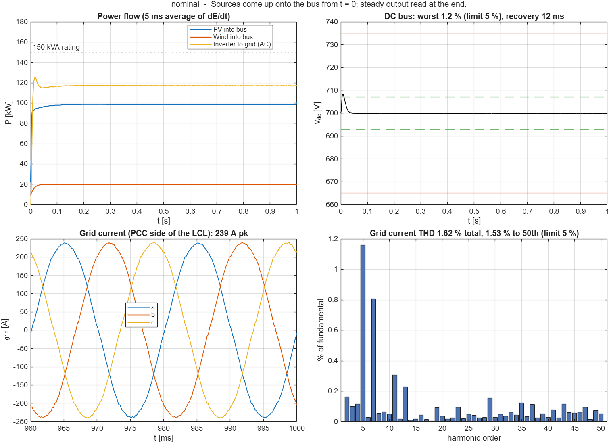
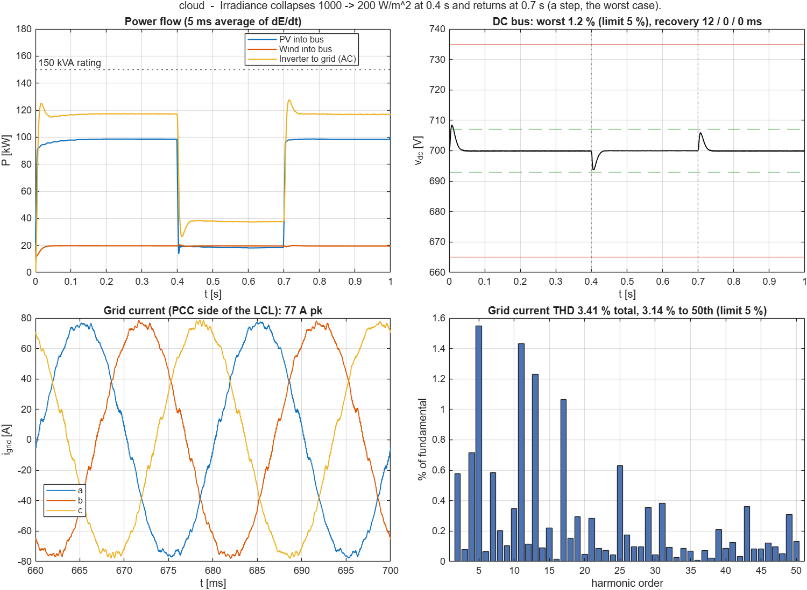
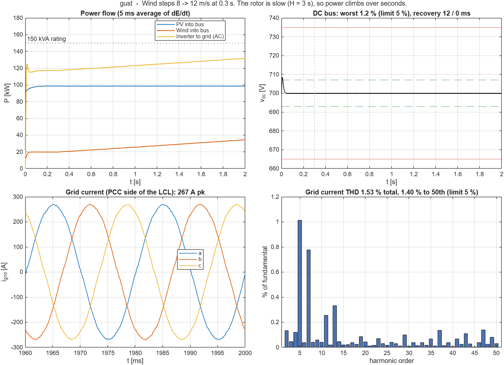
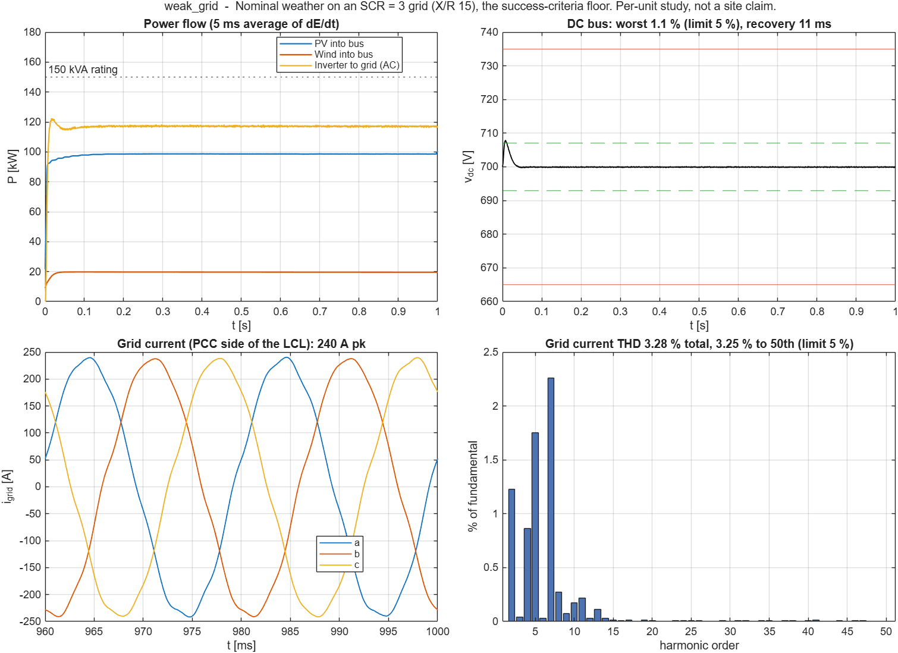
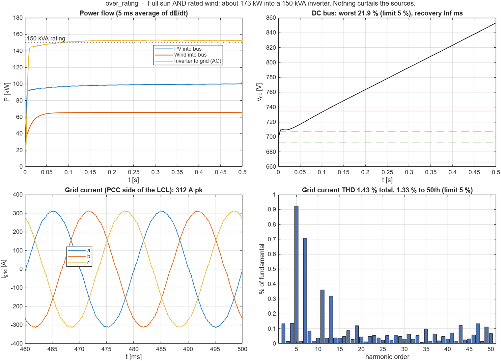

# Integration results: PV + wind + inverter on the 700 V bus

Runs of 2 Oct 2026, MATLAB R2026a, fixed step 0.5 µs. Components as on `main` @ c86f01c:
PV `models/pv-v2` (Belal, switched), wind `models/wind` (Huy, averaged), inverter
`models/inverter` (Duc, switched). The DC bus (44 mF), the DC-link loop and the PLL are
integration stand-ins in this folder (Henry).

The `.mat` logs are not committed (about 250 MB). Regenerate them from this folder:

```matlab
intPaths();
runIntegration();                                   % stand-in PLL, ~14 min -> results/
runIntegration([], Model="intSystem_aqibPLL");      % Aqib's SRF_PLL         -> results/intSystem_aqibPLL/
plotIntegration();                                  % -> results/figures/
checkBuild("intSystem")                             % 44 checks, 44/44 on these runs
```

## Controllers used

| Loop | Gains | Where |
|---|---|---|
| DC-link voltage (stand-in) | P **18.714**, I **18.714 × 94.79 = 1774** (A pk per V), clamp ±306.2 A, anti-windup | `intParams.m` → `xp.dc` |
| PLL (stand-in, `intSystem`) | SRF-PLL, 20 Hz, ζ 0.707: P 177.7, I 15 791 | `intParams.m` → `xp.pll` |
| PLL (`intSystem_aqibPLL`) | Aqib's `SRF_PLL` from `models/control/srf_pll`, 25 Hz, 300 Hz notch | his library |

The DC-link gains were tuned in Control System Designer on the plant
`G = 1/(1.429·0.044·s) · 1/(s/3142 + 1)` (bus capacitor + current loop, in the block's d-axis
units): crossover 310 rad/s, phase margin 67°. They replace the harness gains (12.57 / 251.5).

## Success criteria, per scenario

| Scenario | What happens | Bus worst | Back in ±1 % | Grid THD | PF | P to grid | Verdict |
|---|---|---|---|---|---|---|---|
| nominal | 1000 W/m², 8 m/s, sources come up from t = 0 | 1.21 % | 12 ms | 1.62 % | 0.9988 | 117.0 kW | **PASS** |
| cloud | irradiance steps 1000 → 200 W/m² at 0.4 s, back at 0.7 s | 1.21 % (dip to 693.8 V) | 12 ms | 3.41 % | 0.9962 | 37.5 kW | **PASS** |
| gust | wind steps 8 → 12 m/s at 0.3 s | 1.21 % | 12 ms | 1.53 % | 0.9989 | 130.8 kW | **PASS** |
| weak_grid | nominal weather on an SCR 3 grid (X/R 15) | 1.12 % | 11 ms | 3.28 % | 0.9988 | 117.0 kW | **PASS** |
| over_rating | full sun + 12 m/s: ~173 kW into 150 kVA | 21.9 % (runs to 853 V) | never | 1.43 % | 0.9991 | 152.6 kW | **FAIL** (expected, see A) |

Limits (README): bus < 5 % and back within 200 ms, THD < 5 %, PLL re-lock < 100 ms.
"Back in ±1 %" is our reading of "recover"; the README does not define the band.

## Aqib's SRF_PLL in the same system

| | Stand-in PLL | Aqib's SRF_PLL |
|---|---|---|
| Verdicts | as above | same (4 PASS, over_rating FAIL) |
| Bus worst / recovery (nominal) | 1.21 % / 12 ms | 2.36 % / 26 ms |
| Power factor | 0.9988 | **0.9998** |
| PLL lock-in from 90° / 30° jump re-lock | 41.6 / 36.8 ms | 45.2 / **28.8 ms** |
| Weak-grid f̂ range (t > 0.2 s) | 47.5–52.8 Hz | **48.5–51.4 Hz** |
| `Id_ref` at the 306 A clamp | never | 7–21 ms at start-up |

Aqib's PLL is better everywhere except start-up: it starts at θ = 0 while the grid is at
−π/2, so for the first ~20 ms the current loop works on a wrong angle and the DC loop briefly
saturates. Fix in his block: start at −π/2.

## Open findings

- **A. No curtailment.** When PV + wind exceed the 150 kVA inverter, the bus runs away
  (~290 V/s). Something has to curtail the sources. Owner: team decision.
- **B. Weak-grid PLL frequency ripple.** f̂ swings 47.5–52.8 Hz (stand-in), enough to trip
  frequency protection. Aqib's 300 Hz notch halves it; the 150 Hz part remains. A 20 ms moving
  average on f̂ before any trip, or a slower PLL (10 Hz still re-locks in ~65 ms). Owner: Aqib.
- **C. PV diode D1 Ron = 0.3 Ω** costs about 13 kW. Owner: Belal.
- **D. Aqib's own DC-link loop drives a battery current source**, not the inverter's
  `Id_ref`, so it can't replace the stand-in yet. Owner: Aqib.

## Figures (stand-in PLL)

Each: power flow, DC bus with ±1 % / ±5 % bands, grid current, harmonic spectrum.






